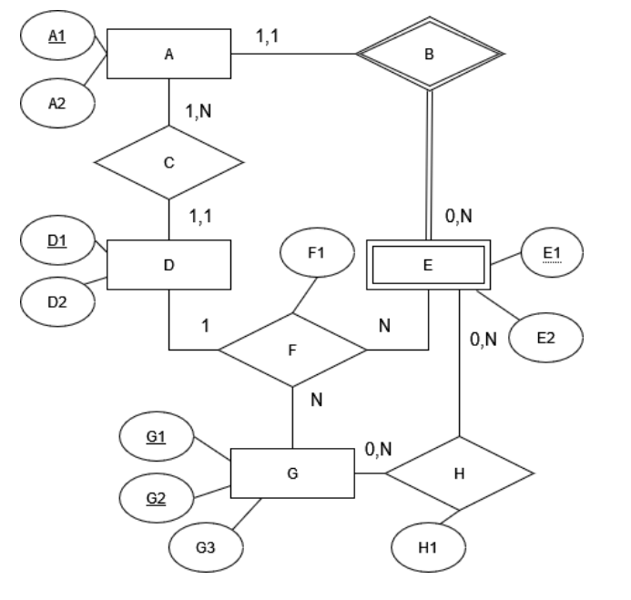

<!-- aca va el contenido del parcialito -->

# Parcialito de Modelado y Álgebra Relacional

**Compromiso ético**: esta evaluación es domiciliaria, le permite evaluar su nivel de comprensión de la materia antes de la evaluación definitiva. Para que tenga validez usted debe garantizar que ha intentado resolverlo con su mejor esfuerzo; y que las respuestas sean el resultado únicamente de su trabajo y conocimiento individuales.

**Importante: recuerden que sólo aceptaremos trabajos presentados en formato pdf**
**y editados en forma electrónica, no fotos, ni manuscritos ni otros formatos devenidos**
**de otras aplicaciones.**

1. ***Pasaje de Modelos***
Para el siguiente diagrama Entidad-Interrelación, realice el pasaje al modelo relacional e
indique para cada relación cuáles son las claves primarias, claves candidatas, claves foráneas y atributos descriptivos. Indique, si las hay, restricciones que no fueron modeladas en el pasaje.

| Relación | Clave Primaria | Claves Candidatas | Claves Foráneas |
| -------- | -------------- | ----------------- | --------------- |
|          |                |                   |                 |

1. ***Álgebra Relacional***
Resuelva las siguientes consultas utilizando Relax y la base de datos utilizada en el taller 3. Copie la consulta en el examen, no la foto, sino las sentencias en formato ejecutable y el
resultado de la misma.

a) Muestre la/las películas que fueron dirigidas por Hitchcock (Alfred (I)) en las cuales
Hitchcock además es actor.
b) Mostrar los nombres y años de filmación, de la/las películas de género dramático (Drama)
más vieja/s de la base.